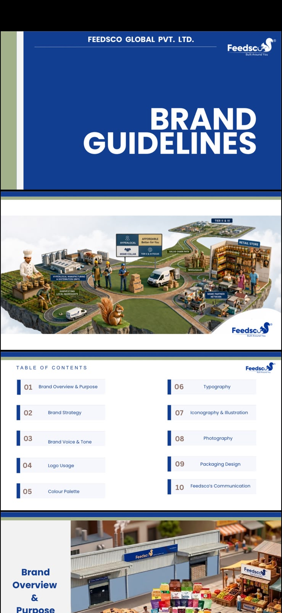

# Feedsco Global Pvt. Ltd. — Summer Internship

## Overview

During my summer internship at **Feedsco Global Pvt. Ltd.**, I gained practical experience in market research, brand strategy, competitor analysis, brand development, and digital marketing. My work focused on understanding consumer behavior, evaluating market positioning, and contributing to the development of a consistent brand identity across marketing channels.

The internship provided an opportunity to connect market research insights with branding decisions and creative social media content to strengthen the company's market presence and digital engagement.

## Key Responsibilities & Contributions

### 1. Market Research

* Conducted market research in **Bhopal and Ahmedabad** to understand the brand's presence in different markets.
* Studied how wholesalers, retailers, and consumers perceive, recognize, and engage with the brand.
* Explored consumer preferences, product awareness, and purchasing behavior.
* Gathered market insights to support brand positioning and marketing decisions.

### 2. Competitor Analysis

* Studied competitors' branding and marketing strategies.
* Evaluated competitor positioning, brand communication, and promotional approaches.
* Analyzed market trends and consumer preferences to identify potential opportunities.
* Used the findings to support brand differentiation and marketing strategy development.

### 3. Brand Guidelines Handbook

One of my key contributions was supporting the development of a comprehensive **Brand Guidelines Handbook** for Feedsco Global Pvt. Ltd.

The handbook was designed to establish a consistent visual identity and communication approach across the brand's marketing materials.

My contributions included:

* Supporting brand strategy and positioning.
* Contributing to brand identity and communication guidelines.
* Organizing visual branding elements and consistency standards.
* Supporting guidelines for logo usage, colour palette, and typography.
* Contributing to the framework for brand voice, tone, photography, illustration, and packaging design.

### Brand Guidelines Handbook — Visual Documentation

*Figure: Feedsco Global Pvt. Ltd. Brand Guidelines Handbook — cover, table of contents, and selected pages.*

The handbook covers the following areas:

1. Brand Overview & Purpose
2. Brand Strategy
3. Brand Voice & Tone
4. Logo Usage
5. Colour Palette
6. Typography
7. Iconography & Illustration
8. Photography
9. Packaging Design
10. Feedsco's Communication

### 4. Digital Marketing & Social Media Content Creation

I gained hands-on experience in digital branding by conceptualizing and producing Instagram Reels and other social media content to support the brand's online presence.

My work included:

* Brainstorming creative concepts for social media content.
* Contributing to the development and production of Instagram Reels.
* Supporting visual storytelling and brand communication through short-form video content.
* Creating content aligned with the brand's marketing and digital branding objectives.
* Contributing to online brand visibility and audience engagement.

## Instagram Reels & Creative Work

The following Instagram Reels showcase examples of my content creation and digital branding work.

* **Reel 1:** [Watch on Instagram](https://www.instagram.com/reel/DYer9zHoIsG/)
* **Reel 2:** [Watch on Instagram](https://www.instagram.com/reel/DYHZC9_MCfn/)
* **Reel 3:** [Watch on Instagram](https://www.instagram.com/reel/DZpeEWoot0G/)

## Skills & Learning Outcomes

Through this internship, I developed practical knowledge and experience in the following areas:

* Market Research & Analysis
* Consumer Behavior Analysis
* Competitor Analysis
* Brand Strategy & Positioning
* Brand Identity Development
* Brand Guidelines Documentation
* Digital Marketing
* Social Media Marketing
* Instagram Reels & Content Creation
* Visual Storytelling
* Creative Communication
* Marketing Research and Insight Generation

## Conclusion

My summer internship at Feedsco Global Pvt. Ltd. provided valuable exposure to the practical aspects of market research, brand development, and digital marketing. Conducting research in Bhopal and Ahmedabad helped me understand consumer perceptions and market dynamics, while competitor analysis provided insights into brand positioning and marketing strategies.

Contributing to the Brand Guidelines Handbook strengthened my understanding of brand consistency and visual communication. Additionally, creating social media content gave me practical experience in digital branding and creative content development.

Overall, this experience helped me understand how market insights, brand strategy, and digital content work together to build a consistent and recognizable brand presence.
